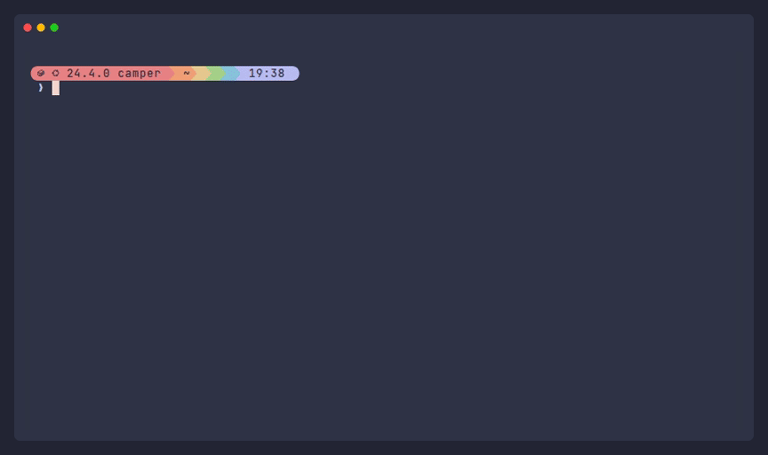

<h1 align="center">⛺ bash-camp</h1>

<div align="center">

**Your bash environment, the same everywhere: a workstation, a container, any server you can ssh
into.** No sudo, no root, no system packages, and no trace left when it goes.

[](https://pixi.prefix.dev)
[](https://github.com/astral-sh/uv)
[](https://starship.rs)
[](https://github.com/akinomyoga/ble.sh)
[](https://atuin.sh)

[](https://www.python.org)
[](https://www.gnu.org/software/bash/)
[](#requirements)
[](https://github.com/astral-sh/ruff)
[](https://github.com/wemake-services/wemake-python-styleguide)
[](https://www.shellcheck.net)
[](LICENSE)



</div>

## Quick start

```sh
git clone https://github.com/<owner>/bash-camp.git && python3 bash-camp/bootstrap.py pitch && exec bash
```

That builds everything into `~/.camp` and opens the new shell. Then:

```sh
camp pitch gpu-1 gpu-2                                         # the same on remote servers
git -C bash-camp pull && python3 bash-camp/bootstrap.py pitch  # update
camp strike                                                    # gone again, the home as it was
```

## Features

- ⚡ **A modern shell from the first prompt**: syntax highlighting and suggestions as you type
  ([ble.sh]), a fast prompt ([starship]), searchable history on Ctrl-R ([atuin]), smart `cd`
  ([zoxide]), fuzzy finding ([fzf]) and bash-completion.
- 🧰 **A curated [toolchain](#toolchain)** from [pixi], kept inside `~/.camp`.
- 📝 **Neovim, ready to code**: language servers, completion, treesitter, Telescope and git signs,
  formatting on save with the same tools `check` uses.
- 🔤 **Icons out of the box**: on a desktop, `pitch` installs [Nerd Fonts] (JetBrainsMono, and
  the symbols for any other font), so the prompt, `ls` and tmux draw icons, not boxes.
- 🛡️ **The system stays in charge**: only an allowlist of shims goes on PATH, so `python3`,
  `git` and coreutils remain the host's.
- 🌐 **Remote servers in one command**: each host is checked first, with everything it lacks listed
  at once; a host without rsync or Python 3.12+ gets a private one.
- 📦 **Containers**: mount `~/.camp` anywhere and source one file.
- 🧹 **No trace**: every change outside `~/.camp` is journaled with what it displaced, and
  `camp strike` restores the home directory byte for byte.
- 🔐 **Your secrets come along**: keys, credentials and env files from a gitignored overlay;
  local-only ones never leave the machine.
- 🤫 **Quiet**: no locale warnings on servers missing your locale, no ble.sh chatter.
- ⛺ **`tent`**: the tmux session to work in, with htop, `watch nvidia-smi` on a GPU host, and a
  shell.
- 🔍 **`check`**: every linter on any files and source trees, with or without git, and one
  `--exclude` for all of them.

## Requirements

| Where | Needs |
|---|---|
| Every machine | Linux on x86_64 or aarch64, bash, curl, tar |
| Network | `pixi.prefix.dev`, `github.com`, `conda.anaconda.org` |
| The machine you pitch from | python3 >= 3.6 to start the installer; ssh and rsync, for remote hosts |

Python 3.12+, git, tmux, make and rsync are taken from the system wherever it has them, and from
pixi where it does not: an older python3 only starts the installer, which brings its own 3.12+ into
`~/.camp`, and a system python3 always stays the one shells find. Nothing needs root.

Neovim installs its plugins and language servers on its first start, from GitHub and PyPI; a C
compiler, where there is one, builds its treesitter parsers and Telescope's fast sorter.

## Commands

| Command | Does |
|---|---|
| `camp pitch` | Install into `~/.camp`, replacing an earlier installation |
| `camp strike` | Uninstall: restore the home directory and delete `~/.camp` |
| `camp pitch HOST...` | Check, ship and install on remote hosts over ssh |
| `camp strike HOST...` | Uninstall on remote hosts |
| `camp scout HOST...` | Only check that remote hosts have what an install needs |
| `camp resupply` | Update only the secrets of the installation here, from `secrets/` |
| `camp resupply HOST...` | Ship only `secrets/` to installed remote hosts and update theirs |
| `tent` | Attach to the `tent` tmux session, creating it first; `tent strike` kills it |
| `check [PATH...]` | Run every linter on files and trees; `--exclude PATTERN` leaves files out of all of them, `--fix` formats and autofixes first, `--skip NAME`, `-v` for more output |
| `docker-gpu-stat` | GPU usage per running Docker container |
| `git-rsafe-add DIR` | Mark every git repository under `DIR` as a `safe.directory` |

Inside a bash-camp checkout, `camp` runs that checkout, and says so: `camp pitch` there installs
and ships your changes. Elsewhere it runs the installed copy in `~/.camp/src`. `camp strike` always
runs the installed copy, the code that made the installation. `-o OPTION` passes ssh options
(`-o Port=2222`). `CAMP_HOME` installs elsewhere than `~/.camp`; remote hosts
always get `~/.camp`.

## Toolchain

| Area | Tools |
|---|---|
| Shell | [ble.sh], [starship], [atuin], [zoxide], [fzf], bash-completion |
| Files and search | [lsd] as `ls`, [bat] as `cat`, [fd], [ripgrep], [Midnight Commander] |
| Editors | [Neovim] with LSP via [mason], completion, treesitter and Telescope; [micro] as `$EDITOR` and `nano` |
| Development | [uv], [ruff], [delta] as git's pager (unless git has one), tree-sitter |
| Monitoring | [htop] |
| Terminal | [tmux] config with [TPM] plugins, xclip for tmux-yank; [Nerd Fonts] on desktops |
| Linters, for `check` | ruff, flake8 with wemake-python-styleguide, shellcheck, [rumdl], [tombi], [yamlfmt], [stylua], [lychee] |

The configs in `config/` (alacritty, atuin, ghostty, gitui, nvim, starship, tmux and the linters)
are symlinked into `~/.config`. `check` gives a project its own linter configs where it has them,
and these otherwise.

## How it works

```text
~/.camp/
├── src/          # the installed copy of this repository
├── pixi/         # a private pixi; yours, if any, is never touched
├── dev-tools/    # the pixi environment, and shims/: the only part on PATH
├── blesh/        # ble.sh, built from source
├── fonts/        # Nerd Fonts, on desktops
├── rc-addon.sh   # what ~/.bashrc sources
├── backups/      # whatever pitch displaced, restored by strike
└── state/        # journal.json, env-files
```

`camp pitch` copies the repository into `~/.camp/src` and builds everything there; the checkout
can then move or go. Outside `~/.camp` it changes only these, each recorded in
`state/journal.json` before it is made, with whatever it displaced:

- config symlinks in `~/.config`, and on desktops one font link in `~/.local/share/fonts`;
- your secrets;
- tmux plugins, and the state directories the tools create later (history, databases, caches),
  only those that did not exist before;
- one line in `~/.bashrc`.

`camp strike` replays the journal backwards and deletes `~/.camp`. Pitching again strikes the old
camp first and keeps only what the tools accumulated: history, databases, caches. Do not delete
`~/.camp` by hand: the journal and the backups live there.

## Secrets

Put your files into `secrets/` next to `bootstrap.py` (gitignored) and list them in
`secrets/manifest.json`:

```json
{
  "$schema": "../secrets.schema.json",
  "files": [
    {"source": "work.env", "load": "env"},
    {"source": "adc.json", "target": "~/.config/gcloud/application_default_credentials.json"},
    {"source": "id_ed25519", "target": "~/.ssh/id_ed25519", "local_only": true}
  ]
}
```

- `"load": "env"`: `KEY=value` lines exported into every shell.
- `"target"`: copied there, a file or a whole directory, with `"mode"` (default `600`, directories
  `700`).
- `"local_only": true`: never shipped to remote hosts; skipped where absent.

The manifest is validated before anything changes. See [`secrets.example/`](secrets.example/);
`secrets.schema.json` gives editors completion.

After changing them, `camp resupply` (here) or `camp resupply HOST...` brings an installation's
secrets up to date without a reinstall: changed ones are updated, new ones placed, and the ones no
longer listed taken back as `strike` would. A placed secret changed on that machine since is kept;
delete it to take the new one. Only `secrets/` is shipped, never the code.

## Containers

```sh
docker run -it -v ~/.camp:/opt/camp IMAGE
echo '. /opt/camp/rc-addon.sh' >> ~/.bashrc     # inside, or in the Dockerfile
```

Any mount point works: the addon finds everything relative to itself. The image needs the host's
architecture and glibc. Run `camp pitch` and `camp strike` on the host; the container only reads.

## Development

For human-beings and agents-beings working on bash-camp itself.

```text
bootstrap.py          # entry point; a plain script, run by a bare python3
camp/                 # the installer; camp/__init__.py maps its modules
camp/rc-addon.sh      # what ~/.bashrc sources, installed verbatim
bin/                  # the commands put on PATH
config/               # tool and linter configs, symlinked into ~/.config
secrets.example/      # the secrets format; secrets/ itself is gitignored
secrets.schema.json   # JSON Schema of secrets/manifest.json
docs/demo/            # docs/demo.gif: a VHS tape played in a container, by record.sh
```

Comments are short, but wherever code looks odd they say why: they record bugs already paid for.
Keep the reason when you edit one. The rules:

- Python 3.12+, standard library only; `bootstrap.py` stays readable to python3 >= 3.6, since it
  brings a newer one. Every function has a docstring with `:param:` and `:return:` lines;
  user-facing failures raise `CampError`.
- Every change outside `$CAMP_HOME` is journaled before it is made, and paths the tools create at
  run time belong in `TOOL_STATE_PATHS`. Steps that touch the home directory live in
  `camp/home.py`, steps that build inside `$CAMP_HOME` in `camp/build.py`; `INSTALL_STEPS` sets
  the order.
- Nothing outside `$CAMP_HOME` points into the checkout, and everything inside it is relocatable.
- pixi is private and only appended to PATH. Only `dev-tools/shims/` (`SHIMMED_EXECUTABLES`) goes
  on PATH, never the pixi env's `bin/`, which would shadow the host's python, git and coreutils.
- tmux, make, rsync and git come from the system where it has them (`FALLBACK_TOOLS`): a second
  tmux cannot attach to the system one's server. bash-camp's own Python 3.12+, where the system's
  is older, is a pixi global environment in `~/.camp/pixi`, which a reinstall keeps.
- The addon loads ble.sh before atuin and attaches it last, since attaching snapshots the prompt.
  ble.sh prints nothing, `LANG` is only set to a locale the system has, `TERM` only as a fallback.
- Secrets are copies, not symlinks.
- Shell: `#!/usr/bin/env bash`, `set -euo pipefail`, `[[ ]]`, 2-space indent, shellcheck-clean,
  every `disable` with its reason. Lua: stylua's format, 2-space indent, 100 columns. Configs open
  with one line saying what they are.

Verify with `bin/check`, and with a round trip in a throwaway home, which must leave it unchanged:

```sh
(
  export HOME=$(mktemp -d); find "$HOME" | sort > /tmp/before
  python3 bootstrap.py pitch && script -qc "bash -ic exit" /dev/null && ~/.camp/src/bin/camp strike
  find "$HOME" | sort | diff /tmp/before - && echo clean
)
```

In a real terminal, `echo $ATUIN_PREEXEC_BACKEND` reads `<n>:blesh-<version>`. A shell fed from a
pipe reads `:none` regardless, so script interactive checks through tmux (`send-keys`,
`capture-pane`).

## Contributing

If you found a bug or want to suggest a new tool or config, your pull request is welcome! I build
this one for my own taste, so if you want to change config parameters or something, go fork
yourself your own repo and have all the fun!

## License and credits

bash-camp is [MIT-licensed](LICENSE). It downloads the tools it installs rather than shipping them,
so each keeps its own license; the Nerd Fonts keep theirs next to them, in `~/.camp/fonts`.

Inspired by [Vezzp/dotfiles](https://github.com/Vezzp/dotfiles).

If you like **bash-camp**, a little ★ on GitHub is much appreciated!

[atuin]: https://atuin.sh
[bat]: https://github.com/sharkdp/bat
[ble.sh]: https://github.com/akinomyoga/ble.sh
[delta]: https://github.com/dandavison/delta
[fd]: https://github.com/sharkdp/fd
[fzf]: https://github.com/junegunn/fzf
[htop]: https://htop.dev
[lsd]: https://github.com/lsd-rs/lsd
[lychee]: https://github.com/lycheeverse/lychee
[mason]: https://github.com/mason-org/mason.nvim
[micro]: https://micro-editor.github.io
[Nerd Fonts]: https://www.nerdfonts.com
[Midnight Commander]: https://midnight-commander.org
[Neovim]: https://neovim.io
[pixi]: https://pixi.prefix.dev
[ripgrep]: https://github.com/BurntSushi/ripgrep
[ruff]: https://github.com/astral-sh/ruff
[rumdl]: https://github.com/rvben/rumdl
[starship]: https://starship.rs
[stylua]: https://github.com/JohnnyMorganz/StyLua
[tmux]: https://github.com/tmux/tmux
[tombi]: https://github.com/tombi-toml/tombi
[TPM]: https://github.com/tmux-plugins/tpm
[uv]: https://github.com/astral-sh/uv
[yamlfmt]: https://github.com/google/yamlfmt
[zoxide]: https://github.com/ajeetdsouza/zoxide
